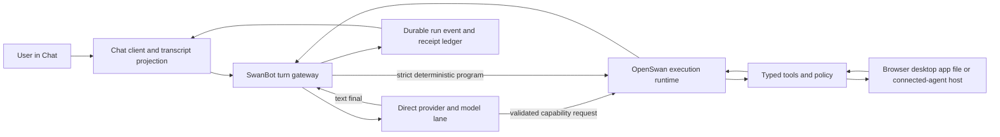

# Chat → SwanBot → OpenSwan Gateway Architecture

**Date:** 2026-08-07
**Status:** Target architecture and migration decision record
**Scope:** Chat ingress, Claude/default-model replies, SwanBot orchestration,
OpenSwan capability execution, connected local bridges, approvals, run events,
and refresh recovery

This document records the target architecture derived from the current UC
runtime and a same-day review of the official OpenClaw repository and
documentation. It does not replace the canonical ownership table in
[`AGENTS_ROADMAP.md`](./AGENTS_ROADMAP.md), the computer-task safety contract in
[`UC_APP_TASK_RELIABILITY_ARCHITECTURE.md`](./UC_APP_TASK_RELIABILITY_ARCHITECTURE.md),
or the current-stack inventory in
[`UC_APP_STACK_REFERENCE.md`](./UC_APP_STACK_REFERENCE.md). Those documents win
if ownership or current-state claims conflict. Any implementation phase that
adds a new canonical owner must update the roadmap before adding the parallel
path.

## 1. Executive decision

The target boundary is:

> **SwanBot owns every accepted Chat turn. Claude Sonnet is the default
> conversational lane. OpenSwan is a same-run capability escalation, not a
> fallback error handler and not an eager classifier for every message.**

Concretely:

1. Chat is a client and projection. It submits one message, receives one
   accepted turn/run identity, renders events, and reconciles authoritative
   state after reconnect. It does not own provider fallback, action risk,
   desktop/browser selection, mutation retry, or terminal truth.
2. SwanBot is the turn gateway and control plane. It owns authentication
   context, thread/session identity, idempotency, queue mode, provider/model
   selection, route state, bounded memory context, capability activation,
   failure classification, and finalization.
3. A normal message starts on the user-selected model, defaulting to Claude
   Sonnet. Greetings, acknowledgements, writing, explanations, and ordinary
   questions remain in that lane.
4. OpenSwan starts only when the user explicitly selects it, a conversation is
   already bound to an active OpenSwan run, a strict deterministic program
   matches, or the model requests a capability that SwanBot validates as
   relevant, available, and policy-allowed.
5. Promotion from direct Chat to OpenSwan preserves the same `turnId` and
   `runId`. It is a state transition inside one accepted turn, not a second
   user message, a second assistant placeholder, or a fallback transport.
6. Provider, credential, memory, web-search, CORS, and transport failures do
   not change the intent lane. They either degrade an optional service or end
   the current lane with an exact recovery action.
7. One cohesive user goal remains one task root. “Open Photoshop and create a
   600 × 600 document” is one ordered desktop program, not two unrelated asks.
8. Approval is action-specific. Launch/focus, observation, and explicitly
   requested reversible local creation do not inherit plan-level approval.
   Destructive, credential, payment, publish/send, permission, and other
   externally consequential actions retain their exact approval boundaries.

## 2. Current UC ownership and the architectural problem

### 2.1 Existing canonical owners

The target must extend these owners rather than create another stack:

| Concern | Current canonical owner |
|---|---|
| Chat UI and send orchestration | `src/screens/circles/tabs/ChatTab.tsx` |
| Transcript and thread lifecycle | `src/lib/chatService.ts`, `src/lib/circleChatThreads.ts`, `src/lib/subscribeWithReconnect.ts`, Chat thread components |
| Attachment intake and description-only visual boundary | `src/lib/chatMedia.ts`, `src/lib/chatAttachments.ts`, `src/lib/attachmentPreflightCore.ts`, `src/lib/attachmentRoutingCore.ts`, `src/lib/chatVisualBriefCore.ts`, `src/lib/chatVisualBrief.ts`, `src/lib/swanbotStream.ts`, `supabase/functions/chat-stream/index.ts` |
| Chat plan classification and dispatch | `src/lib/chatAutomationPlanner.ts`, `src/lib/chatTransportHandlers.ts`, `src/lib/runChatAutomationPlan.ts`, `src/lib/chatTerminalTransportPolicy.ts` |
| Connected coding-agent selection and handoff | `src/lib/chatAgentTargets.ts`, `src/lib/connectedAgentDispatch.ts`, `src/lib/terminalAgentControl.ts`, `src/lib/terminalAgentSessionLauncher.ts`, `src/lib/customAgentBridgeDispatcher.ts` |
| SwanBot request, transport, v2 continuation, and client tools | `src/lib/swanbot.ts`, `src/lib/swanbotV2BatchRuntime.ts`, `src/lib/swanbotV2BatchPolicy.ts`, `supabase/functions/swanbot-v2-ai/index.ts` |
| Provider-agnostic model/tool loop | `src/lib/agentExecutionCore.ts` |
| OpenSwan session execution | `src/lib/openswanSessionRuntime.ts` |
| OpenSwan tool policy and execution | `src/lib/openswanToolRuntime.ts`, `src/lib/openswanToolApprovals.ts` |
| Computer task route and exact programs | `src/lib/chatComputerRequestRouter.ts`, `src/lib/computerSequenceProgramCore.ts`, `src/lib/computerTaskRuntime.ts` |
| Computer root/action authority | `src/lib/computerTaskRoot.ts`, `src/lib/computerTaskRootStore.ts` and the §26 database gateway |
| Local capabilities | `src/lib/agentAutoConnect.ts`, `src/lib/desktopBridge.ts`, browser bridge and app adapters |
| Run/event persistence | `src/lib/eventBoundCore.ts`, `src/lib/agentRunPersistence.ts`, `src/lib/agentRunSystem.ts` |
| Claude streaming and BYOK proxy | `supabase/functions/chat-stream/index.ts`, `supabase/functions/llm-proxy/index.ts`, `supabase/functions/_shared/edge.ts` |

### 2.2 The gap

The repository already states the desired “models first, activate capabilities
when needed” direction in `src/lib/swanbot.ts`, but the collaboration seam is
advisory. The roadmap also records that the highest-blast-radius terminal
`run_plain_chat` and `run_openswan` paths have not completed the single-executor
migration. Consequently, ownership can still be split across the UI,
classifier, provider stream, SwanBot v1/v2, OpenSwan session runtime, and
computer-task runtime.

The user-visible failure classes follow from that split:

- a greeting can accidentally activate web search, recovery, or OpenSwan;
- a provider error can fall through to a different execution lane;
- one cohesive app goal can be split into separate “asks” before execution;
- a desktop request can inherit browser routing, file evidence, or approvals it
  did not require;
- a missing capability can produce a plan or approval before actionability is
  established;
- refresh can leave local UI state out of sync with the authoritative run and
  encourage duplicate retries;
- progress or approval presentation can steal foreground focus by raising the
  browser instead of publishing state;
- memory or embedding failures can generate repeated noise on an otherwise
  healthy Chat turn.

The repair is not another intent router. It is one accepted-turn gateway with
clear ownership and a small number of typed transitions.

## 3. Official OpenClaw research and lessons

Research was performed against official OpenClaw commit
[`4cbbfc215953602d5789ae866343567bb3a7dfd5`](https://github.com/openclaw/openclaw/commit/4cbbfc215953602d5789ae866343567bb3a7dfd5)
from 2026-08-07. Only the official repository and official documentation were
used.

### 3.1 One gateway owns the control plane

OpenClaw uses one long-lived Gateway for clients, channels, nodes, sessions,
models, tools, approvals, and server-pushed events. WebChat is a client of that
Gateway rather than a second orchestration runtime.

**UC lesson:** SwanBot should be the logical Gateway for Chat turns. ChatTab
must progressively lose orchestration authority and retain presentation,
interaction, and local projection responsibilities.

Sources:

- [Gateway architecture](https://docs.openclaw.ai/concepts/architecture)
- [Gateway protocol](https://docs.openclaw.ai/gateway/protocol)
- [Building a Gateway client](https://docs.openclaw.ai/gateway/clients)

### 3.2 Accept quickly, then stream typed lifecycle events

OpenClaw validates a turn, resolves the session, returns a `runId` immediately,
then streams assistant, tool, and lifecycle events. A Chat final is emitted
from lifecycle completion, not inferred from an arbitrary HTTP response.
Side-effecting methods use idempotency keys.

**UC lesson:** one synchronous admission boundary should create the durable
turn/run identity before provider, bridge, planner, or tool work. Everything
after admission is an event on that run.

Sources:

- [Agent loop](https://docs.openclaw.ai/concepts/agent-loop)
- [Gateway protocol](https://docs.openclaw.ai/gateway/protocol)

### 3.3 Route deterministically and serialize by session

OpenClaw deterministically maps ingress to an agent and session. It then
serializes runs per session while allowing bounded concurrency across sessions.
Mid-run messages have explicit `steer`, `followup`, `collect`, and `interrupt`
semantics.

**UC lesson:** route ownership, session ownership, and queue behavior are
different decisions and must not be re-derived independently by multiple
clients or edge functions.

Sources:

- [Messages](https://docs.openclaw.ai/concepts/messages)
- [Channel routing](https://docs.openclaw.ai/channels/channel-routing)
- [Command queue](https://docs.openclaw.ai/concepts/queue)

### 3.4 Separate provider, model, runtime, and channel

OpenClaw treats provider authentication, model selection, execution runtime,
and message channel as separate layers. Explicit runtime choices fail closed.
External ACP harnesses such as Claude Code or Cursor are selected explicitly or
through a durable conversation binding; they are not an error fallback for an
ordinary model reply.

**UC lesson:** Anthropic/Claude is a provider/model route; OpenSwan is an
execution runtime; a desktop bridge is a capability host; Chat is the client.
Those labels must never substitute for one another.

Sources:

- [Agent runtimes](https://docs.openclaw.ai/concepts/agent-runtimes)
- [ACP agents](https://docs.openclaw.ai/tools/acp-agents)

### 3.5 Advertised capability is not authority

OpenClaw clients and nodes advertise capabilities during connection. Tools
whose required client capabilities are missing are omitted before the model
call. Capability advertisement does not itself grant permission.

**UC lesson:** SwanBot must build the model-visible capability surface from a
fresh, exact bridge snapshot. A capability being connected makes a tool
eligible; authenticated task/action identity and policy still authorize it.

Sources:

- [Building a Gateway client](https://docs.openclaw.ai/gateway/clients)
- [Tools overview](https://docs.openclaw.ai/tools)

### 3.6 Bind approval to the exact executable action

OpenClaw applies the stricter of configured and host-local execution policy.
Approval-backed node runs store a canonical command/cwd/session plan and reject
post-approval drift. Approval events can be replayed to an authorized client.

**UC lesson:** keep the existing digest-bound, single-use OpenSwan authority,
but request it only after capability and target actionability are established.
The approval service must not be a prerequisite for an approval-free action.

Sources:

- [Exec approvals](https://docs.openclaw.ai/tools/exec-approvals)
- [Operator scopes](https://docs.openclaw.ai/gateway/operator-scopes)

### 3.7 Reconnect by adopting authoritative state, not resending

An OpenClaw client reconnects, resubscribes, reloads canonical history, adopts
an in-flight run even when it has no text, and reconciles per-run sequence
numbers. A sequence gap causes an authoritative refresh.

**UC lesson:** refresh must never re-submit the last user message or start a
second root. It should rebuild the projection and attach to the existing run.

Source: [Building a Gateway client](https://docs.openclaw.ai/gateway/clients)

### 3.8 Memory is optional to the reply path

OpenClaw separates curated and episodic memory, performs deterministic recall
first, and escalates to deeper recall only for relevant historical intent. Its
memory architecture explicitly makes memory failure non-blocking for replies.

**UC lesson:** memory lookup, extraction, embedding, and repair must have a
bounded fallback and must never activate OpenSwan, fail a greeting, or create a
recovery-agent card.

Sources:

- [Memory architecture](https://docs.openclaw.ai/concepts/memory-architecture)
- [Active memory](https://docs.openclaw.ai/concepts/active-memory)

### 3.9 Treat ambiguous post-side-effect state as unknown

OpenClaw records outbound send intent before the platform call and a receipt
after success. When a process can no longer prove whether the platform call
succeeded, the state is `unknown_after_send` and replay requires
reconciliation.

**UC lesson:** preserve the existing `outcome_unknown` computer/OpenSwan rule.
Retries may repeat only pre-dispatch work or a reconciled action proven not to
have happened.

Source: [Message lifecycle refactor](https://docs.openclaw.ai/concepts/message-lifecycle-refactor)

### 3.10 Specialized authority surfaces are explicit

OpenClaw’s setup/repair system agent is entered explicitly and receives one
restricted typed authority tool. Persistent changes require exact approval.
Its external ACP runtime likewise requires explicit invocation or a durable
binding.

**UC lesson:** OpenSwan modes, connected coding agents, and repair agents should
be explicit or capability-activated. A provider failure must never silently
turn an ordinary conversation into a privileged repair session.

Sources:

- [OpenClaw setup agent](https://docs.openclaw.ai/cli/openclaw)
- [ACP agents](https://docs.openclaw.ai/tools/acp-agents)

## 4. Target responsibility model



### Source-landed description-only image handoff (2026-08-07)

Chat now has one narrow multimodal ingress without turning every connected
coding-agent bridge into a file server:

1. An image-bearing turn lazily creates one turn-scoped visual-brief promise.
   `chatVisualBrief.ts` reads only the composer images it can validate and makes
   at most one authenticated Anthropic `chat-stream` request, using Claude
   Sonnet by default. The one result is shared across every consumer in that
   turn.
2. The edge validates the complete multimodal envelope before credential use:
   only bounded user-role JPEG/PNG/GIF/WebP base64 blocks with matching file
   signatures are admitted; message, block, text, image, decoded-byte, and
   request-size limits apply; assistant and system content remain text-only.
3. `chatVisualBriefCore.ts` is the pure trust boundary. It converts model/OCR
   output into at most three bounded artifacts containing only a safe basename
   and a redacted observation. URLs, data URIs, storage/local paths, tenant/run
   identifiers, secrets, long opaque values, control text, and nested prompt
   markers are removed. Each block states that the content is untrusted visual
   evidence and instructions inside it must not be followed.
4. Selected connected-agent, terminal send/launch, and multi-agent dispatch
   append that same text-only block. Raw image bytes, object/signed URLs,
   storage keys, tenant identifiers, and local paths never cross the Claude
   Code, Codex, Cursor, Gemini, or custom bridge. A turn with no visual artifact
   keeps its original dispatch prompt byte-for-byte.
5. Explicit selected-agent, named Claude Code/Codex, terminal, multi-agent, and
   coding/build intent owns an attached image before the broad desktop-file
   heuristic. An implementation screenshot therefore reaches the selected
   coding agent instead of being reclassified as “open this image in a desktop
   app.” A natural explicit target such as “ask Claude Code/Codex to …” reuses
   a manageable provider session or launches one managed provider session when
   the corresponding bridge is online. It never falls through to OpenSwan or
   plain-model AI; bridge-offline is a truthful terminal error for that
   requested lane. The image alone does not activate OpenSwan.
6. If an image-dependent brief cannot be produced, the connected-agent handoff
   fails closed before dispatch. Chat reports the bounded inability to inspect
   the image; it does not pass a truncated base64 prefix, guess at pixels, or
   silently wake another runtime.

This is a source implementation plus focused smoke coverage, with the changed
`chat-stream` edge deployed as production version 16. An authenticated live
image-to-connected-agent E2E remains pending. The next exact-file tier must
use an opaque, expiring handle bound to user, circle/thread, turn/task,
provider/session, hash, and bridge instance; ambient local paths and bearer
URLs remain forbidden. Connected-agent launch/send acknowledgements also still
need adoption into the durable typed final-result lifecycle before they can
prove completion.

### Chat client

Owns:

- composer, attachments, thread selection, optimistic user row;
- rendering assistant, tool, approval, progress, proof, and recovery events;
- stop, steer, follow-up, approval, and explicit retry interactions;
- reconnect, scoped catch-up, and projection reconciliation;
- accessibility, responsive layout, and non-focus-stealing notifications.

Does not own:

- final route selection;
- provider/runtime fallback;
- action risk or approval policy;
- capability truth;
- bridge retries or mutation replay;
- terminal completion truth.

### SwanBot turn gateway

Owns:

- authenticated user/circle/thread/session context;
- one durable admission and idempotency decision;
- `direct_model`, `deterministic_program`, `openswan`, and bound-run routing;
- selected provider/model and strict credential behavior;
- bounded optional memory/search enrichment;
- queue mode and active-run steering;
- same-run capability promotion;
- structured failure classification and terminal event emission.

### Direct model lane

Owns:

- ordinary Claude/model inference;
- text streaming;
- a small capability activation/search surface;
- no local or external mutation authority.

The direct model may request a capability. It may not authorize the request,
change the delivery channel, change the task target, or select a less-exact
fallback surface.

### OpenSwan runtime

Owns:

- tool search and the eligible tool surface;
- observation, actionability, action, and proof sequence;
- approval lookup/request/consume when the exact action requires it;
- task checkpoints, bounded continuation, and truthful terminal status;
- connected-agent/subagent delegation when explicitly selected or required.

It does not own the Chat transcript, provider credential recovery, or a second
copy of session identity.

### Capability hosts

Own:

- versioned capability declaration;
- exact local target/app/window/page identity;
- host-local permission and approval enforcement;
- one-attempt typed execution;
- structured dispatch receipt and after-state proof;
- no intent inference and no cross-surface fallback choice.

## 5. Exact activation matrix

The routing result is one of:

```ts
type ChatTurnLane =
  | 'host_command'
  | 'direct_model'
  | 'direct_model_optional_search'
  | 'deterministic_program'
  | 'openswan'
  | 'bound_runtime'
  | 'reconcile_only'
  | 'user_action_required';
```

| Input/state | Initial lane | OpenSwan activation | Approval behavior | Required result |
|---|---|---|---|---|
| Greeting, thanks, acknowledgement | `direct_model` | Never | None | One normal model reply; no search/task/recovery card |
| Explanation, writing, brainstorming, ordinary Q&A | `direct_model` | Only if the model emits a valid capability request needed to answer | Per eventual action only | Text final or same-run promotion |
| Explicit request for current web facts/research | `direct_model_optional_search` | Only the web capability needed; do not start computer use | None for read-only search | Sourced answer; search failure degrades to plain Chat |
| Slash/host navigation command | `host_command` | Only if the command contract says so | Command-specific | Deterministic local result |
| Strict “open/focus/launch App” command | `deterministic_program` | Uses the typed OpenSwan/computer action chokepoint without a planner model | None beyond explicit request | Fresh before/after exact-app proof |
| “Open Photoshop and create a 600 × 600 document” | `deterministic_program` when compiler coverage exists; otherwise `openswan` | Yes, once, as one task root | No fresh Chat approval for launch or reversible unsaved document creation | One ordered program and final 600 × 600 app-native status proof |
| Read screen/app/document/file state | `openswan` | Immediately after capability preflight | None for read-only observation | Bounded observation and answer |
| Edit/create in an app | `openswan` | Immediately after capability preflight | Only for the exact risk category; reversible local edits may run from explicit user intent | Action receipt plus after-state proof |
| Delete, overwrite, flatten, publish, send, post, pay, purchase, grant permission, reveal/use credentials | `openswan` | Yes | Exact single-use approval required immediately before dispatch | Approval-bound receipt and proof |
| User explicitly selects an OpenSwan mode | `openswan` | At admission | Per action policy | OpenSwan lifecycle visible and truthful |
| Follow-up in a bound OpenSwan/connected-agent conversation | `bound_runtime` | Reuse binding | Per new action only | Steer/followup same owned session |
| User asks for Claude Code/Codex/Cursor/Gemini explicitly | `bound_runtime` or explicit external-harness delegation | Reuse a manageable matching session or launch one managed provider session while its bridge is online; never substitute OpenSwan/plain AI | Harness and action policy | Tracked child/background run, or truthful terminal bridge-offline error |
| User asks a selected coding agent to inspect an uploaded image | `bound_runtime` or explicit external-harness delegation | Image analysis does not activate OpenSwan; the explicit agent target owns routing | Harness/action policy only; description is read-only context | One turn-scoped redacted visual brief plus tracked agent run, or no dispatch when the image is unreadable |
| Model emits `activate_capability` | Current run transitions to `openswan` | Only after SwanBot validates intent, target, policy, and fresh capability | Per action policy | Same `turnId` and `runId` continue |
| Anthropic key missing/unreadable | `user_action_required` | Never | None | Exact Marketplace reconnect action |
| Memory/embedding unavailable | Original lane | Never because of memory failure | None | Reply continues without memory; quiet repair debt |
| Optional web search unavailable | `direct_model` | Never because of search failure | None | Plain Chat with bounded “not web verified” notice if relevant |
| Required bridge/tool unavailable | `user_action_required` | No executable run yet | Do not create an approval for an impossible action | Smallest capability/permission unblock |
| Approval pending | Existing lane, `waiting_approval` state | Already active | No duplicate request | Durable approval card; resume exact action after approval |
| Mutation dispatch outcome ambiguous | `reconcile_only` | No replay | No new approval changes this fact | Fresh observation/reconciliation only |
| Provider/transport error before any output/action | Same original lane | Never solely because of error | None | Bounded same-route retry if classified safe, else exact failure |

### Activation invariants

1. Keyword presence alone cannot activate OpenSwan.
2. A target and an actionable verb must resolve together. “Open to ideas,”
   “launch a plan,” and “create a story” remain conversational.
3. An exact desktop target cannot silently become a browser target.
4. Capability activation is additive to the same run; it does not duplicate
   the user message.
5. A compound sequence sharing one target and outcome is one root even when it
   contains several ordered steps.
6. Optional enrichments never own terminal failure.
7. A credential failure cannot select another user credential, provider,
   runtime, or agent unless the user configured that fallback and the route
   explicitly permits it.
8. Attached image bytes are analyzer input, not connected-agent authority.
   Only the bounded redacted description may cross the current bridge, and an
   unreadable image cannot be replaced with inferred or truncated-base64 text.

## 6. Turn, run, task, action, and event contract

### 6.1 Identity hierarchy

```text
thread/session
└─ turnId                 one accepted user message
   └─ runId              one lifecycle spanning direct model and promotion
      └─ taskRootId?     one cohesive computer/external-action goal
         └─ actionId?    one typed observable or mutating action
            ├─ toolUseId? provider-issued tool call identity
            └─ approvalId? exact single-use authority when required
```

- `clientRequestId` is generated before send and is the idempotency key for
  admission. The same client retry receives/adopts the existing `turnId` and
  `runId`.
- `turnId` never changes because the lane changes.
- `runId` remains stable through direct-model tool activation, approval wait,
  continuation, and verification.
- `taskRootId` exists only for task-bearing work and binds the whole cohesive
  goal.
- `actionId` is the smallest dispatch/reconciliation identity.
- `toolUseId` never substitutes for `actionId`; it adds provider provenance.

### 6.2 Event envelope

All user-visible and durable run events should project through one versioned
envelope:

```ts
interface ChatRunEventV1 {
  schemaVersion: 1;
  eventId: string;
  occurredAt: string;

  userId: string;
  circleId: string;
  threadId: string;
  sessionKey: string;
  clientRequestId: string;
  turnId: string;
  runId: string;
  taskRootId?: string;
  actionId?: string;
  toolUseId?: string;
  approvalId?: string;

  sessionSequence: number;
  runSequence: number;
  lane: ChatTurnLane;
  type:
    | 'turn.accepted'
    | 'route.resolved'
    | 'model.started'
    | 'model.delta'
    | 'capability.requested'
    | 'capability.activated'
    | 'run.started'
    | 'tool.started'
    | 'tool.progress'
    | 'approval.requested'
    | 'approval.resolved'
    | 'tool.completed'
    | 'proof.recorded'
    | 'run.completed';
  status:
    | 'accepted'
    | 'running'
    | 'waiting_approval'
    | 'waiting_user'
    | 'reconciling'
    | 'completed'
    | 'failed'
    | 'blocked'
    | 'cancelled'
    | 'outcome_unknown';
  payload: Record<string, unknown>;
}
```

The durable `payload` is a projection, not a raw tool transcript. Preserve the
existing value-free persistence rules: no keys, credentials, full prompts,
raw local paths, raw tool arguments/results, screenshots, document contents,
or arbitrary provider errors. Exact values remain only in the transient sealed
execution/approval path required to perform and prove the action.

### 6.3 State machine

```text
accepted
  → routing
  → running
     → waiting_approval → running
     → waiting_user     → running
     → reconciling      → completed | failed | outcome_unknown
  → completed | failed | blocked | cancelled | outcome_unknown
```

Rules:

- one run has one terminal status;
- only lifecycle ownership may emit a terminal event;
- `waiting_approval` and `waiting_user` are non-terminal;
- `outcome_unknown` is terminal for automatic replay but may create a separate
  observation-only reconciliation continuation;
- a direct-model credential error remains a direct-model terminal, not a
  computer/OpenSwan terminal;
- a tool call is marked dispatched before the external/local attempt and gains
  a receipt/proof only from authoritative post-attempt evidence.

## 7. Refresh and reconciliation contract

### 7.1 Reconnect sequence

On first load, tab restore, network reconnect, or browser refresh:

1. Authenticate the current user and re-resolve exact circle/thread access.
2. Load the authoritative transcript projection and current session head.
3. Read the last accepted `sessionSequence` and any active `runId` values.
4. Replace stale local durable rows with the scoped server projection while
   preserving only valid optimistic rows keyed by `clientRequestId`.
5. Re-establish thread/message/run/approval subscriptions.
6. Adopt the active run even if no assistant text has arrived.
7. Merge later events by `(runId, runSequence)` and ignore duplicates or lower
   sequences.
8. On a sequence gap, invalidation-only event, or ambiguous local projection,
   fetch a new authoritative snapshot. Do not resend the user message.

### 7.2 Required guarantees

- Refresh never creates a new `turnId`, `runId`, `taskRootId`, or mutation.
- The original `clientRequestId` survives network retries and optimistic-row
  recovery.
- A stale thread callback cannot write into a newly selected thread.
- A thread switch either waits for or explicitly cancels its owned run; it does
  not leave hidden work writing to the previous transcript.
- Approval backfill is reconciled by `approvalId`; a resolved approval cannot
  be resurrected by a racing list response.
- A pending approval resumes only its original action identity.
- If an action was dispatched but its terminal receipt is missing, refresh
  enters reconciliation and never executes it again automatically.
- New user input during a run is explicitly classified as `steer`, `followup`,
  `collect`, or `interrupt`; it is not submitted to a parallel run on the same
  session.
- Reconnect, progress, approval, and bridge-heartbeat code must not call browser
  focus APIs. The browser becomes frontmost only when the user explicitly asks
  to act in it.

## 8. Approval and capability boundaries

### 8.1 Authority chain

Every action follows this order:

```text
authenticated actor and scope
→ accepted turn/run identity
→ fresh capability eligibility
→ exact target identity and actionability
→ effective action policy
→ exact approval when required
→ single-use dispatch claim
→ one external/local attempt
→ receipt and after-state proof
```

No later layer may repair or weaken a failed earlier layer.

### 8.2 Capability contract

A capability snapshot must include:

- host/bridge identity and authenticated user binding;
- capability/tool name and schema version;
- supported action categories;
- app/browser/node identity where applicable;
- readiness and permission state;
- observation timestamp and expiry;
- whether the host can present/enforce approval;
- evidence/proof surfaces it can return.

Rules:

- missing capability means the tool is withheld from model selection;
- stale capability means re-observe before action;
- connected does not mean authorized;
- browser availability does not satisfy a named desktop-app request;
- an unavailable tool cannot generate a fake “ready” plan or approval;
- a capability buildout route is its own explicit user-reviewed task, not an
  automatic fallback inside the original action.

### 8.3 Approval categories

The policy matrix in the computer-task architecture remains authoritative. The
Chat gateway applies these user-experience rules:

| Category | Default interaction |
|---|---|
| Conversation, explanation, memory/search read | No approval |
| Read-only screen/app/file/browser observation | No approval after capability/permission readiness |
| Exact app launch/focus/wait | No approval; fresh exact-app proof required |
| Explicitly requested reversible local creation/edit | No extra plan-level approval unless a narrower policy requires it |
| External send/post/publish, credential/login/grant, payment/purchase | Exact approval immediately before dispatch |
| Delete/trash/overwrite/destructive conversion/permission/security change | Exact approval immediately before dispatch |
| Unknown risk, target mismatch, missing proof surface | Fail closed |

An operating-system permission dialog is a user-action blocker, not a Chat plan
approval. Chat should explain the smallest exact permission step and then
re-observe.

### 8.4 Approval invariants

- Approval binds actor, user, circle, thread, turn, run, task root, action,
  tool, provider `toolUseId`/iteration, target, exact canonical arguments, and
  current policy digest.
- Approval is single-use and has an expiry.
- Approval lookup failure blocks only actions that actually require approval.
- A broad “computer task” approval does not authorize unrelated future steps.
- A compiled immutable plan manifest may summarize an exact program, but each
  mandatory risk floor remains enforceable at dispatch.
- A capability or argument change invalidates approval.
- The approval surface never steals foreground focus from the target app.

## 9. Failure and retry semantics

| Failure | Owner | Retry rule | User experience |
|---|---|---|---|
| `key_missing` / `credential_unreadable` | Provider lane | No same-turn alternate runtime; retry only after credential changes | Focused Marketplace reconnect |
| Optional web search failure | Optional search lane | No action retry; continue direct model | Answer with bounded verification caveat when needed |
| Memory/embedding failure | Memory subsystem | Queue bounded repair; do not retry in foreground | Usually invisible |
| Pre-dispatch transient transport error | Current lane | At most bounded same-route retry under same idempotency identity | Brief working/retry status only when material |
| Missing bridge/app/tool | Capability layer | Re-probe once; then user action or explicit buildout | Smallest unblock, no impossible approval |
| OS login/license/modal/permission | Capability host | No blind retry; wait for user and re-observe | Exact requested user step |
| Approval unavailable | Approval layer | Keep pending if request was durably created; otherwise fail without dispatch | Durable approval status, not generic failure |
| Tool rejected before dispatch | OpenSwan | Safe correction may retry under same run with a new action identity | Concise corrected next step |
| Mutation outcome ambiguous | Action/reconciliation layer | Never replay automatically | “Could not verify”; observe/reconcile |
| Proof does not match requested outcome | Verification layer | Bounded corrective action only when no duplicate side effect is possible | Partial/failed with observed state |

Recovery never broadens authority. “Let a connected agent repair it” is offered
only for a runtime/code defect that a connected agent can safely diagnose. It
is not offered for greetings, provider credentials, missing user permissions,
or ordinary upstream outages.

## 10. User-facing Chat contract

The architecture should make Chat feel simpler even as the runtime becomes more
capable:

- A greeting produces a greeting, not a plan, receipt, web search, OpenSwan
  card, or recovery agent.
- A task gets one concise working state and one result. Internal routing,
  evidence contracts, and tool inventories stay hidden unless the user opens
  details.
- The UI says “OpenSwan available” until a run actually activates it.
- A compound goal is described by its outcome, not counted as clauses.
- Progress uses stable stages such as Preparing, Working, Waiting for approval,
  Verifying, and Done.
- Approval cards show the exact consequential action, target, and consequence.
- Blockers identify the smallest user action and preserve the run for resume.
- Retry is shown only when the system can state why it is safe.
- Stop cancels or neutralizes the owned run without manufacturing a failure.
- Browser/Chat UI never repeatedly raises itself above the app being operated.

## 11. Phased migration, file owners, and eval gates

The phases intentionally extend current canonical files. New core files require
a roadmap ownership update first.

### Phase 0 — Contract and observability baseline

**Goal:** Lock the activation matrix and measure current misroutes before
changing the terminal pipeline.

**Owners:**

- `src/lib/chatAutomationPlanner.ts`
- `src/lib/chatTerminalTransportPolicy.ts`
- `src/lib/swanbotRouting.ts`
- existing run/decision telemetry owners

**Work:**

- encode pure route outcomes for the matrix above;
- add counters for selected lane, activation reason, provider/runtime, and
  terminal status without message content;
- prove that greetings have zero optional-search/OpenSwan/computer/recovery
  activation;
- record compound-task cohesion decisions.

**Exit gates:**

- `npm run smoke:simple-chat-task-guardrails`
- `npm run smoke:web-search-auto-detect`
- `npm run smoke:chat-planner`
- `npm run smoke:chat-terminal-transport-policy`
- `npm run smoke:swanbot-routing`
- new table-driven activation-matrix smoke with the Photoshop compound case

### Phase 1 — One accepted-turn gateway

**Goal:** Make SwanBot the one admission/idempotency owner for terminal Chat
model paths without changing visible answers.

**Owners:**

- `src/lib/swanbot.ts`
- `src/lib/swanbotTurnDedupe.ts`
- `src/lib/chatTransportHandlers.ts`
- `src/lib/runChatAutomationPlan.ts`
- `src/screens/circles/tabs/ChatTab.tsx` as client adapter only
- `src/lib/agentExecutionCore.ts`

**Work:**

- create/adopt one `clientRequestId`, `turnId`, and `runId` before transport;
- route `run_plain_chat` and `run_openswan` through one terminal handler map;
- make credential failures terminal to the selected provider lane;
- eliminate fallback from greeting/provider error into OpenSwan or connected
  recovery;
- keep user-selected model semantics strict.

**Exit gates:**

- `npm run smoke:chat-transport-handlers`
- `npm run smoke:swanbot-turn-dedupe`
- `npm run smoke:chat-lane-outcome`
- Marketplace credential-error and plain-greeting integration cases
- no duplicate provider call for one `clientRequestId`

### Phase 2 — Same-run capability activation

**Goal:** Let the direct model activate eligible capability without creating a
second turn/run.

**Owners:**

- `src/lib/agentExecutionCore.ts`
- `src/lib/swanbot.ts`
- `src/lib/swanbotV2BatchRuntime.ts`
- `src/lib/openswanSessionRuntime.ts`
- `src/lib/openswanToolRuntime.ts`

**Work:**

- expose a bounded capability activation/tool-search surface to direct Chat;
- validate activation in SwanBot against intent, target, tool policy, and live
  capabilities;
- transition the existing run to OpenSwan;
- keep one transcript/user turn and one terminal lifecycle;
- withhold all unavailable client-only tools before the model call.

**Exit gates:**

- `npm run smoke:agent-core`
- `npm run smoke:anthropic-native-tool-search`
- `npm run smoke:swanbot-v2-continuation`
- `npm run smoke:swanbot-v2-delegation`
- a same-run assertion proving stable `turnId`/`runId` across activation
- a negative assertion proving unavailable capabilities never reach dispatch

### Phase 3 — Durable event projection and refresh adoption

**Goal:** Make refresh/reconnect a projection repair, never a task replay.

**Owners:**

- `src/lib/eventBoundCore.ts`
- `src/lib/agentRunPersistence.ts`
- `src/lib/agentRunSystem.ts`
- `src/lib/chatService.ts`
- `src/lib/subscribeWithReconnect.ts`
- `src/lib/circleChatThreads.ts`
- `src/screens/circles/tabs/ChatTab.tsx`

**Work:**

- project the versioned event envelope;
- expose active run plus last session/run sequences in scoped hydration;
- adopt in-flight runs after refresh;
- detect gaps and trigger scoped authoritative refresh;
- reconcile optimistic rows by `clientRequestId`;
- backfill pending approvals by id;
- prevent old-thread callbacks from mutating the selected thread.

**Exit gates:**

- `npm run smoke:circle-chat-threads-realtime`
- `npm run smoke:chat-session-state-persistence`
- `npm run smoke:chat-checkpoints`
- refresh during model stream, tool execution, approval wait, and verification
- duplicate/lower/gapped event-sequence tests
- two-client same-thread idempotency test

### Phase 4 — Capability and approval convergence

**Goal:** Request approval only for an executable exact action and enforce it at
the final action host.

**Owners:**

- `src/lib/openswanToolApprovals.ts`
- `src/lib/openswanToolRuntime.ts`
- `src/lib/computerTaskRoot.ts`
- `src/lib/computerTaskRootStore.ts`
- `src/lib/computerTaskRuntime.ts`
- `src/lib/agentAutoConnect.ts`
- `src/lib/desktopBridge.ts` and exact browser/app hosts

**Work:**

- version capability declarations and freshness;
- withhold absent tools;
- distinguish eligibility from authority;
- move approval lookup after capability/target readiness;
- guarantee approval-free actions never depend on approval service health;
- replay/backfill pending approval state without duplicating it;
- retain digest-bound single-use dispatch authority and `outcome_unknown`.

**Exit gates:**

- `npm run smoke:openswan-runtime-approval`
- `npm run smoke:swanbot-v2-approvals`
- `npm run smoke:chat-approval-single-use`
- `npm run smoke:connected-app-capability-refresh`
- `npm run smoke:computer-task-root`
- `npm run smoke:computer-task-root-store`
- `npm run smoke:computer-task-root-action-gateway`
- approval-service outage test: launch/read still works, risky mutation blocks

### Phase 5 — Compound deterministic computer programs

**Goal:** Complete common app tasks first try without clause splitting or
unrelated evidence/approval inheritance.

**Owners:**

- `src/lib/chatComputerRequestRouter.ts`
- `src/lib/computerSequenceProgramCore.ts`
- `src/lib/computerTaskRuntime.ts`
- `src/lib/genericAppNavigator.ts`
- app-native adapters and `src/lib/computerAppAdapter.ts`
- `src/lib/computerTaskEvidenceContract.ts`

**Work:**

- compile one root for same-target ordered clauses;
- extend exact programs from lifecycle-only to narrow high-value reversible
  creation sequences;
- compile “Open Photoshop and create 600 × 600” to observe → launch/wait if
  needed → create → verify;
- ensure desktop ownership excludes browser and local-file evidence;
- make no-active-document an expected initial state;
- verify actual dimensions through the app-native status tool;
- never foreground Chat/browser for progress.

**Exit gates:**

- `npm run smoke:chat-computer-request-router`
- `npm run smoke:computer-task-activation`
- `npm run smoke:generic-app-navigator`
- `npm run smoke:computer-task-evidence-contract`
- `npm run smoke:computer-pipeline-e2e`
- cold Photoshop, warm Photoshop, no active document, existing document,
  permission/modal blocker, refresh mid-run, and duplicate-send canaries

### Phase 6 — UI simplification and progressive rollout

**Goal:** Remove legacy orchestration from ChatTab and make route state
understandable without exposing internal plans.

**Owners:**

- `src/screens/circles/tabs/ChatTab.tsx`
- Chat thread/header/transcript components
- `src/lib/chatAgentSelectorPresentation.ts`
- `src/lib/chatComputerRequestUx.ts`
- `src/lib/chatFailureRecovery.ts`
- run-history components

**Work:**

- render only the gateway event projection;
- show OpenSwan as active only after activation;
- remove clause-count copy for cohesive goals;
- show one compact working state, one exact approval when needed, and one final;
- stop offering connected-agent repair for non-code/user-action failures;
- remove all browser-focus behavior from reconnect/progress/approval paths;
- retain details and run history for debugging.

**Exit gates:**

- `npm run check:openswan-chat-ux`
- accessibility and narrow/wide layout checks
- no-focus-steal live desktop canary
- authenticated local Chat E2E for greeting, direct reply, web-search degrade,
  approval wait, refresh adoption, app task, and credential reconnect
- `npm run typecheck:app`
- `npm run build`
- `git diff --check`

### Phase 7 — Deprecation and production enforcement

**Goal:** Delete or disable duplicate terminal paths after telemetry proves the
gateway route.

**Owners:** the roadmap owners of each legacy path.

**Work:**

- mark replacements in `AGENTS_ROADMAP.md` before deleting callers;
- remove direct ChatTab provider/OpenSwan terminal orchestration;
- disallow v1 fallback after any v2/client tool or server-side mutation attempt;
- enforce one run/event schema in release readiness;
- add production fault injection for provider, database, edge, bridge,
  approval, app, and reconnect boundaries;
- retain an explicit safe rollback that does not re-enable replay-unsafe paths.

**Exit gates:**

- complete Chat/OpenSwan release suite;
- SwanBot/OpenSwan readiness report;
- production authenticated greeting and Claude response;
- production app-task canary with local user participation;
- fault-injection evidence for pre-dispatch retry versus post-dispatch
  reconciliation;
- zero duplicate `clientRequestId` executions and zero greeting activations in
  the rollout window.

## 12. Required evaluation matrix

At minimum, automated fixtures should cover:

### Conversation negatives

- `hello`
- `thanks`
- `why would I use Express?`
- `create a short story`
- `I am open to ideas`
- `launch into an explanation`

Expected: direct model, no search/OpenSwan/computer/recovery activation.

### Optional enrichment

- explicit current-news/search request succeeds;
- search returns 4xx/5xx;
- memory embedding returns `key_missing`;
- memory embedding returns `credential_unreadable`;
- memory breaker is already open.

Expected: the Chat reply survives; only the relevant optional feature degrades.

### App tasks

- `Open Photoshop`
- `Focus Photoshop`
- `Open Photoshop and create a 600 x 600 document`
- same request while Photoshop is already frontmost;
- same request while Chrome is frontmost;
- bridge offline;
- Photoshop license/login/modal blocker;
- refresh after launch but before create;
- refresh after create but before verification;
- duplicate network submission with the same `clientRequestId`.

Expected: one root, correct desktop route, no unrelated file/browser checks,
no duplicate mutation, final app-native proof.

### Approval policy

- launch/read while approval service is down;
- reversible local creation;
- delete layer/file;
- publish/send/post;
- credential/login/payment/permission action;
- approved arguments drift before dispatch;
- approval resolved while client reconnects;
- dispatched mutation loses receipt.

Expected: approval only where required, exact single use, no drift, no replay of
ambiguous dispatch.

### Concurrency and refresh

- two devices submit the same `clientRequestId`;
- user steers an active run;
- user interrupts an active run;
- thread switch during active work;
- lower/duplicate event sequence;
- forward event gap;
- resolved approval races pending-list backfill;
- reconnect with active run and zero assistant text.

Expected: one authoritative run and deterministic reconciliation.

## 13. Non-goals and differences from OpenClaw

1. **UC is multi-user and multi-circle.** OpenClaw documents a trusted
   single-operator Gateway and does not claim hostile multi-tenant isolation.
   UC must keep Supabase auth, RLS, per-user credential policy, per-circle
   authority, and per-user local bridge pairing. A `sessionKey` is never an
   authorization token.
2. **No broad host-exec default.** OpenClaw’s personal-assistant defaults are
   unsuitable for a shared web product. UC retains least privilege, tool
   policy, exact approvals, local host enforcement, and proof.
3. **No single shared DM session.** UC sessions remain scoped by user, circle,
   thread, selected agent, and explicit runtime binding.
4. **No in-process-only durability.** UC spans browser, Edge, Postgres, local
   bridges, and external providers. Admission, dispatch claims, approvals,
   continuation, and terminal truth require durable identities and leases.
5. **No file-based multi-tenant memory adoption.** UC should adopt OpenClaw’s
   provenance, tiering, bounded recall, and non-blocking failure properties,
   not its local filesystem storage topology.
6. **No “every message is a full agent task” UX.** UC intentionally keeps a
   direct-model fast lane and promotes only when capability is needed.
7. **No automatic cross-runtime recovery.** OpenSwan, Claude Code, Codex,
   Cursor, browser, desktop, and provider routes remain explicit capabilities,
   not interchangeable fallbacks.
8. **No claim of universal app control before proof.** The architecture is a
   convergence plan. Each app/action family becomes supported only after its
   capability, safety, and live verification gates pass.
9. **No raw chain-of-thought or secret-rich event ledger.** User-visible
   progress and durable events remain structured, bounded, and value-free.
10. **No UI-driven foreground ownership.** Chat rendering, heartbeat,
    reconnect, and approvals never raise Chrome over the application the user
    is operating.

## 14. Success criteria

The migration is successful when all of the following are true:

- `hello` always reaches one selected-model call and never OpenSwan/search;
- every submitted message has one durable admission identity;
- direct Chat can activate a capability without changing turn/run identity;
- a user refresh adopts work instead of replaying it;
- credentials, memory, and optional search failures remain in their own lanes;
- OpenSwan sees only tools supported by fresh capabilities;
- approval-free work is independent of approval-service health;
- every risky action consumes one exact approval and produces one dispatch
  receipt;
- every ambiguous mutation enters reconciliation instead of retry;
- one same-target compound request produces one task root;
- “Open Photoshop and create a 600 × 600 document” completes first try when
  Photoshop and its bridge are healthy;
- Chat/browser never steals foreground focus during another-app work;
- terminal status is derived from the run lifecycle, not error prose;
- legacy duplicate terminal paths are removed only after production telemetry
  and fault-injection gates pass.

## 15. Official OpenClaw source index

- [Official repository](https://github.com/openclaw/openclaw)
- [Reviewed commit](https://github.com/openclaw/openclaw/commit/4cbbfc215953602d5789ae866343567bb3a7dfd5)
- [Gateway architecture](https://docs.openclaw.ai/concepts/architecture)
- [Gateway protocol](https://docs.openclaw.ai/gateway/protocol)
- [Building a Gateway client](https://docs.openclaw.ai/gateway/clients)
- [Agent loop](https://docs.openclaw.ai/concepts/agent-loop)
- [Messages](https://docs.openclaw.ai/concepts/messages)
- [Command queue](https://docs.openclaw.ai/concepts/queue)
- [Channel routing](https://docs.openclaw.ai/channels/channel-routing)
- [Agent runtimes](https://docs.openclaw.ai/concepts/agent-runtimes)
- [ACP agents](https://docs.openclaw.ai/tools/acp-agents)
- [Tools overview](https://docs.openclaw.ai/tools)
- [Exec approvals](https://docs.openclaw.ai/tools/exec-approvals)
- [Operator scopes](https://docs.openclaw.ai/gateway/operator-scopes)
- [Memory architecture](https://docs.openclaw.ai/concepts/memory-architecture)
- [Active memory](https://docs.openclaw.ai/concepts/active-memory)
- [Message lifecycle refactor](https://docs.openclaw.ai/concepts/message-lifecycle-refactor)
- [OpenClaw setup agent](https://docs.openclaw.ai/cli/openclaw)
- [OpenClaw security model](https://docs.openclaw.ai/gateway/security)
